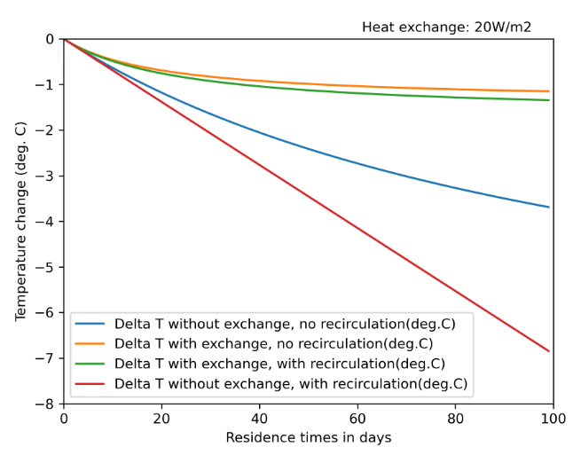
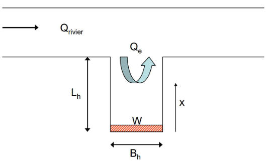

# Document Preprocessing Comparison Report

## Overview

This report provides a comparison of different document preprocessing libraries tested with PDF documents. The documents and results can be found in the ``examples`` directory. 

## Converters Tested

1. **Unstructured.io**
2. **MarkItDown** (Microsoft)
3. **Docling** (IBM)
4. **Mistral** (LLM)

## Methodology

Three documents are converted each time with a different converter. Time in seconds is recorded for each run. The resulting markdown files are compared visually against the original PDF. Conclusions are drawn based on the correct identification and parsing of the following elements to markdown:

- Paragraph
- Title and/or subtitle
- Table
- Scientific formula
- Image

## Test Documents

Three scientific papers are used with different levels of formatting. 
1. Immissietoets technical documentation (EIT): formatting with (sub)-titles, figures and a lot of different formulas. 44 pages.
2. How Different Landscape Elements Limit the Breeding
Habitatof Meadow Bird Species (bird paper): scientific paper with two columns layout, some images and tables. 8 pages.
3. Kennisoverzicht en aanbevelingen schelpenwinning Waddenzee (shellfish paper): report from Deltares with map charts, one table and one formula. 12 pages.

## Results

### Spend perfomance

Below is a figure of the time in seconds taken to run each converter. The leader is mark-it-down by far. Then Mistral performs also quite fast. Unstructured.io is consistently the most time consuming.

|     | Paper (1) | Paper (2) | Paper (3) |
| --- | --- | --- | --- |
| Unstructured.io | 850.27 | 119.78 | 111.37 |
| Mark-it-down | 1.65 | 0.35 | 0.57 |
| Docling | 654.01 | 34.38 | 52.24 |
| Mistral | 47.08 | 8.46 | 17.44 |

### Feature Comparison

The table below gives a generic overview of the findings when comparing the converters from PDF to markdown with visual assessment of the results.

|     | Paragraph | (sub)Title | Table | Formula | Image |
| --- | --- | --- | --- | --- | --- |
| Unstructured.io | Well found, but a page break creates a new paragraph. Possibility to easily remove headers, footers or page numbers from the end result. | Titles are found correctly most times, but no sub titles is available. | Struggles with indexes that can be found at the beginning of documents but tables found inside the text are well identified | There are partially identified and formated correctly. If identified, the characters are not always correct and can lead to errors, especially on multiple lines. Letters of non-latin alphabet are identified. | Returns the base64 of the image, but no textual interpretation. |
| Mark-it-down | Good identification. Page numbers and other header/footer are kept. | Titles are isolated but not marked specifically, they are treated the same as paragraphs | Only raw numbers are extracted. The actual format of the table is lost. | Correctly identified and formatted only for simple operation (plus, minus, multiplication). A fraction or otherwise more complex layout is not correctly interpreted. Letters from a non-latin alphabet are not found. | Not supported |
| Docling | Good identification. Noise such as page numbers is removed. Paragraphs are maintained even with a page break in between. | Titles and sub-titles are correctly identified. Sometimes list items are considered titles. | Best performance on tables. Well identified and keeps formating. | Good identification and transcription to latex. Some errors are still noted, especially sometimes a formula becomes a title. | Identify that an image was there and gives a placeholder comment in the markdown but no real exploitable interpretation of the image is available. |
| Mistral | Good identification of paragraphs, they can be broken up by page breaks. | Titles and sub-titles are correctly identified. | Also very good performance. Indexes can be shown as a paragraph. | Best perfomance of the above. Very successful rate of formula recognition and well transcribed to markdown. | Very powerful image interpretation. Model can return a detailed explaination of a figure or a chart with the right prompt. |

## Recommendations

Overall, Mistral gives very good results for a fraction of the time needed for Docling. Moreover, a very Mistral is capable of annotating images in a very precise way (cf appendix). The prompt only asks for a description of a few sentences but already the response can be exploited to bring more clarity to the rest of the text. We can also adapt the prompt endlessly to ensure more precise data and even extract formated tables of raw data if a chart is represented for example.

## Appendix

### Different images and their description by Mistral

As examples are different images found in paper (1) and the corresponding text that Mistral came up with when prompted with a description.

#### A chart

_"The graph illustrates the temperature change (in degrees Celsius) over residence times (in days) under different conditions of heat exchange and recirculation. The heat exchange rate is 20W/m2. Four scenarios are depicted: Delta T without exchange and no recirculation, Delta T with exchange and no recirculation, Delta T with exchange and with recirculation, and Delta T without exchange and with recirculation. The graph shows that the temperature change is least severe (i.e., closest to 0 degrees Celsius) when there is both heat exchange and recirculation, and most severe (i.e., drops to -8 degrees Celsius) when there is no heat exchange and no recirculation. The presence of either heat exchange or recirculation mitigates the temperature drop to varying extents."_

#### A schema

_"The image is a schematic diagram representing a river and an exchange flow. The diagram shows a river flowing from left to right, denoted by Q_rivier. There is an exchange flow, Q_e, depicted by an upward arrow through a vertical section of the river. The vertical section has a height L_h and a width B_h. The exchange flow occurs over a width W at the bottom of this section. The distance from the bottom of the vertical section to the river's surface is denoted by x. The diagram illustrates the interaction between the river flow and the exchange flow within a specific segment of the river."_